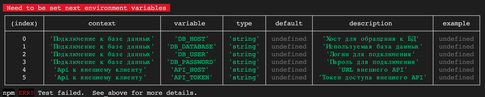

This library for made configuring files with validation, prepare data and export documentation.

## install

```bash
npm i @be-true/config --save
```
or
```bash
yarn add @be-true/config
```

## Goals
- The configuration should be replaced with a regular JSON object
- Zero dependencies
- Minimalism API
- Simple
- TypeScript friendly

## Features
- [x] Detect error on start with report
    
- [x] Export your configurations to MD table

    | context      | required | variable    | type                                          | default          | description                                  | example |
    |--------------|----------|-------------|-----------------------------------------------|------------------|----------------------------------------------|---------|
    | Database     | yes      | DB_HOST     | url                                           |                  | Host                                         |         |
    | Database     | yes      | DB_DATABASE | string                                        |                  | Database name                                |         |
    | Database     | yes      | DB_USER     | string                                        |                  | Login                                        |         |
    | Database     | yes      | DB_PASSWORD | string                                        |                  | Password                                     |         |
    | External API | yes      | API_HOST    | url                                           |                  | URL of external API                          |         |
    | External API | yes      | API_TOKEN   | string                                        |                  | Access token of external API                 |         |
    | WEB server   | yes      | APP_HOST    | url                                           | http://localhost | URL address of application                   |         |
    | WEB server   | yes      | APP_PORT    | integer                                       | 3000             | Port of application                          |         |
    | WEB server   | yes      | APP_ENV     | enum: production, staging, develop, localhost | localhost        | Environment in which application will be run |         |
    | WEB server   |          | APP_NAME    | string                                        |                  | Name of application                          |         |

- [ ] Security. All envs variables cleared after first usage
- [ ] Allowed set dependency env variable from other variables

## Usage

```typescript
import { ConfigBase, configClass } from "@be-true/config";

@configClass
export class ServerConfig extends ConfigBase implements IServerConfig {
  context: string = "Настройки WEB сервера";
  get appHost() {
    return this.fromEnv("APP_HOST")
      .description("URL address of application")
      .required()
      .default("http://localhost")
      .asUrl();
  }

  get appPort() {
    return this.fromEnv("APP_PORT")
      .description("Port of application")
      .required()
      .default(3000)
      .asInteger();
  }

  get appEnv() {
    return this.fromEnv("APP_ENV")
      .description("Environment in which application will be run")
      .required()
      .default("localhost")
      .asEnum(["production", "staging", "develop", "localhost"]);
  }

  get appName() {
    return this.fromEnv("APP_NAME")
      .description("Name of application")
      .asString();
  }
}
```

See [DETAIL](./example/README.MD)

## License
Copyright (c) 2021 beTrue contributors.

## TODO
- Method asArrayEnum should be add.
- Method toString need to improve for class ConfigBase.
- Saver documentation to marked section of MD file.
- Split sections in MD table through context message.